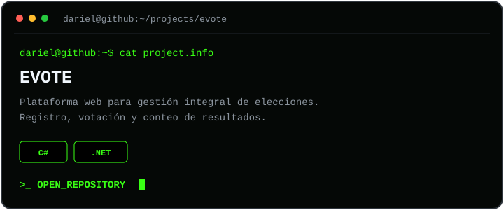
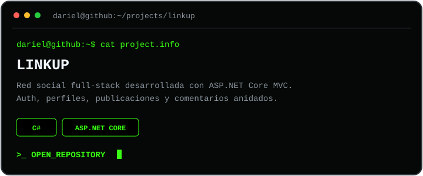
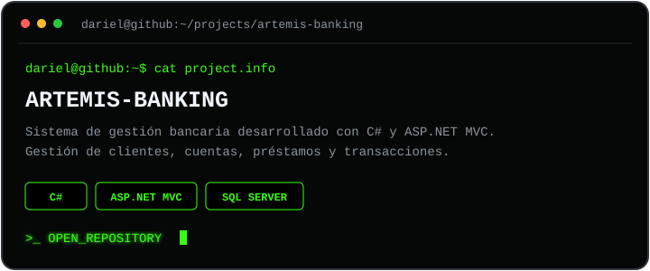
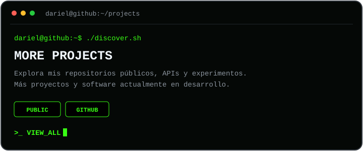

<p align="center">
  
</p>

<p align="center">
  
</p>

<br>

```console
┌──(dariel㉿github)-[~]
└─$ whoami

Dariel Capellán
Software Developer
Dominican Republic


┌──(dariel㉿github)-[~/profile]
└─$ cat about.txt

> Backend-focused Software Developer
> Building web applications, APIs and scalable systems.
> Interested in software architecture, cloud development
> and modern backend technologies.


┌──(dariel㉿github)-[~/profile]
└─$ cat focus.txt

[+] Backend Development
[+] REST API Development
[+] Full-Stack Applications
[+] Software Architecture
[+] Databases
[+] Cloud & Containers
```

## `root@dariel:~# ./stack.sh`

<p align="center">


<br>


<br>


</p>

<br>

## `root@dariel:~# cat technologies.conf`

```yaml
backend:
  - C#
  - ASP.NET Core
  - Node.js
  - NestJS
  - Express

frontend:
  - React
  - Next.js
  - TypeScript
  - JavaScript

databases:
  - PostgreSQL
  - SQL Server
  - MySQL

data:
  - Prisma
  - Entity Framework

devops:
  - Docker
  - Git
  - GitHub

tools:
  - Visual Studio Code
  - Visual Studio
  - Postman
```

<br>

## `root@dariel:~# ls -la ./projects`

```console
┌──(dariel㉿github)-[~/projects]
└─$ ls -la

drwxr-xr-x  eVote/            → Plataforma de votación electrónica
drwxr-xr-x  LinkUp/           → Red social full-stack
drwxr-xr-x  Artemis-Banking/  → Sistema de gestión bancaria
```

<p align="center">
  <a href="https://github.com/DarieC18/eVote">
    
  </a>
  &nbsp;
  <a href="https://github.com/DarieC18/LinkUp">
    
  </a>
</p>

<p align="center">
  <a href="https://github.com/DarieC18/Artemis-Banking">
    
  </a>
  &nbsp;
  <a href="https://github.com/DarieC18?tab=repositories">
    
  </a>
</p>

<br>

## `root@dariel:~# ./stats.sh`

<p align="center">
  
</p>

<p align="center">
  
</p>

<br>

## `root@dariel:~# ./contributions.sh`

<p align="center">
  
</p>

<br>

## `root@dariel:~# ./connect.sh`

```console
[+] Establishing secure connection...

STATUS     SERVICE        ADDRESS
──────────────────────────────────────────────────────────
ONLINE     LinkedIn       dariel-capellan-835a55378
ONLINE     Email          darielcapellan@gmail.com

[+] Connection endpoints ready.
```

<p align="center">
  <a href="https://www.linkedin.com/in/dariel-capellan-835a55378/">
    
  </a>
  <a href="mailto:darielcapellan@gmail.com">
    
  </a>
</p>

<br>

```console
┌──(dariel㉿github)-[~]
└─$ echo "Keep building."

Keep building.

┌──(dariel㉿github)-[~]
└─$ █
```

<p align="center">
  
</p>
